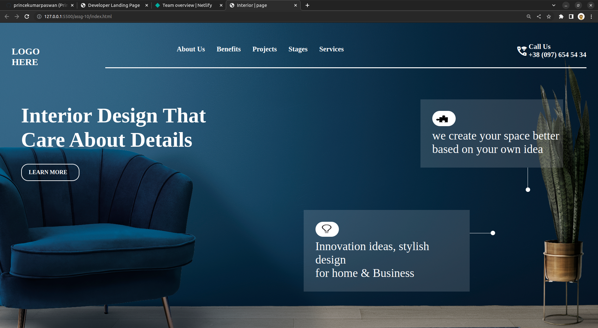

# Interiour Design | Page - HTML & CSS!

By Prince Kr Paswan

## [Link to the Interiour Design Page (project-10)](https://developerlanding-page.netlify.app/)

## What I learned While creating this page?

- learned how to make cards with transparent background.
- Learnd to use css position  property.
- I learned how to add custom fonts.
- I learned about image positioning and image hight.

## This project took around 4 hours to complete.
